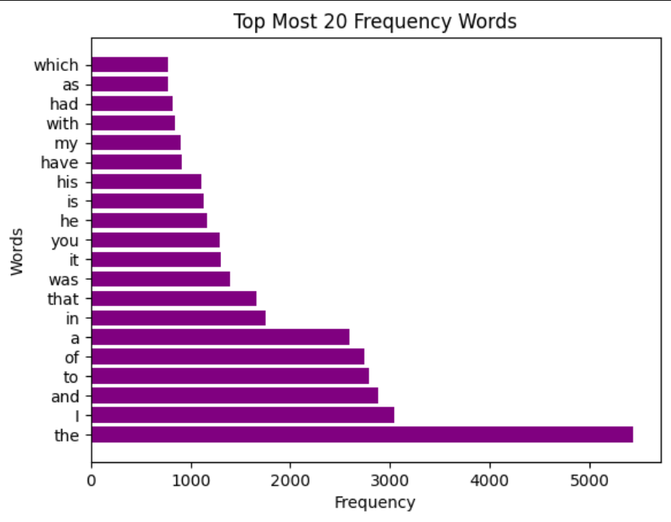
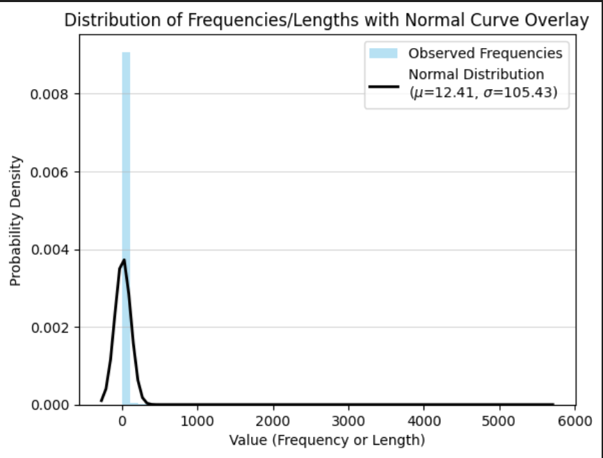
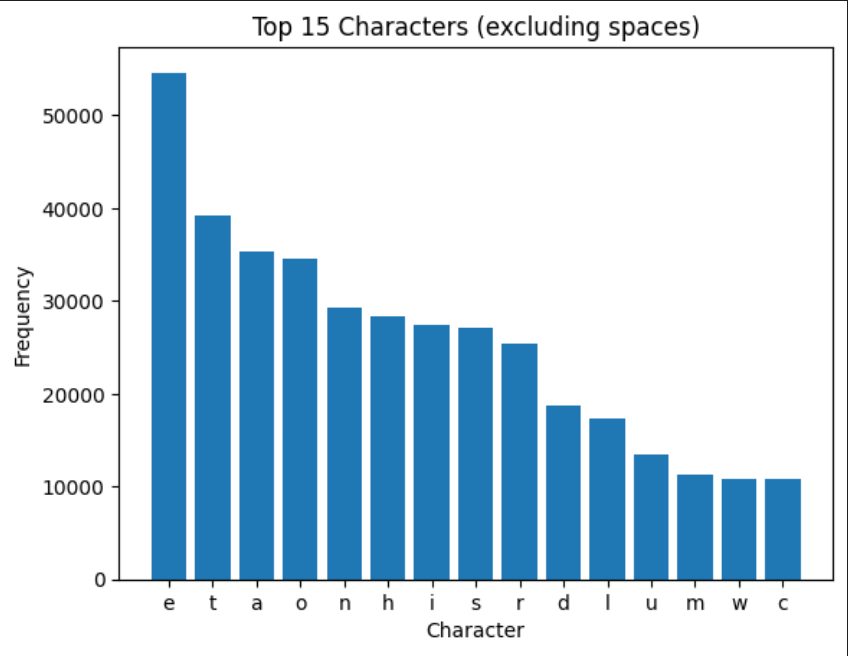
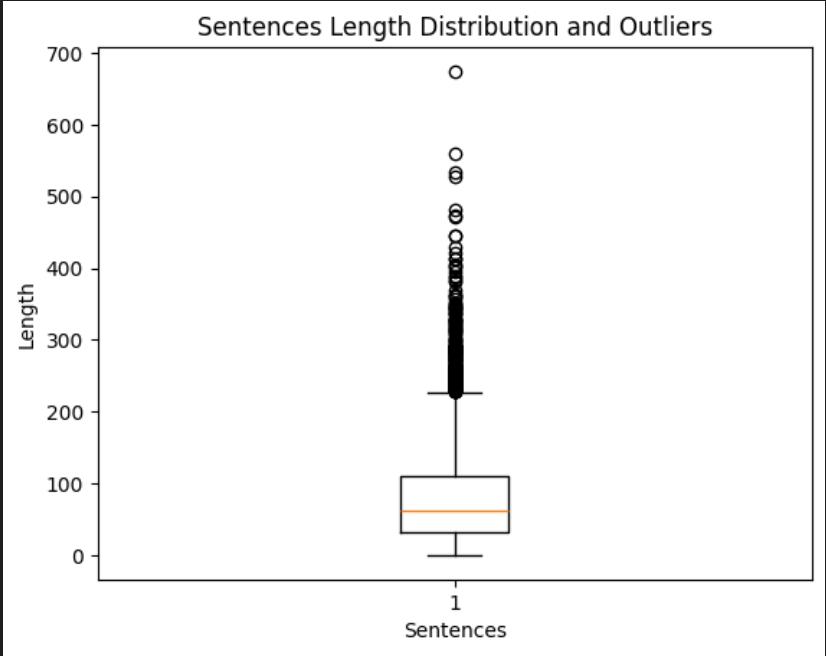
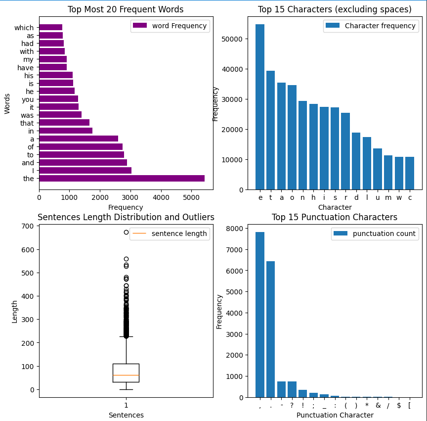

# Gutenberg Books ("Sherlock Holmes")

## Table Of Content

* [Data Loading](#data-loading)
* [Regular Expression Pattern Extraction](#regular-expression-pattern-extraction)
* [Text Statistics With Numpy](#text-statistics-with-numpy)
* [Data Visualization With Matplotlib](#data-visualization-with-matplotlib)
* [Pandas Data Analysis](#pandas-data-analysis)

## Data Loading
Using A Text File Consisting Of The Sherlock Holmes Book From Gutenberg

```
filePath="/content/sherlock.txt"
```
## Regular Expression Pattern Extraction
Using module __re__ to perform regular expressions on many key insights like

__Email Extraction__

Analyzing If They Are Any email addresees and creating a list of unique addresees
```
def extract_emails(text):
  data=re.findall(r"\b[a-zA-Z0-9._%+-]+@[A-Za-z0-9.-]+\.[A-Z|a-z]{2,}\b",text)
  return data
```

__Phone Number Extraction__

Analyzing Phone Numbers Of Different Formats like:

+ (123) 456-7890
+ 123-456-7890
+ +1-123-456-7890

And Finally Normalizing Them To Standard Format.

__Extracting  Mentions And HashTags__

Extrating Words That Specifically Start With __(# or @)__

```
['#1661']
```
__Extracting Dates__

Extracting Dates With Different Formats Like __DD/MM/YYYY, MM-DD-YYYY, Month DD, YYYY__
```
def extract_dates(text):
  dates=re.findall(r"\d{2}[/\-]\d{2}[/\-]\d{4}|[A-Z][a-z]+ \d{1,2}, \d{4}",text)
  return dates
```
__Extracting Currency__

Finding If Their Are Any Currency Values Like __($100, £50, €75)__
```
def extract_currency(text):
  data=re.findall(r"[£$€]\d+(?:\.\d{2})?",text)
  return data
```

## Text Statistics With Numpy
__Word Frequency Analysis__

This Section Uncovers Insights Like:

+ Creating a word Frequency Dictionary to perform oppereations __like mean,median,mode__.
+ finding percentiles for __(25th,50th,75th)__.

```
Mean Of Word Frequency: 12.413380442215637
Median Of Word Frequency: 2.0
Standard DeviationOf Word Frequency: 105.42930768195718
25th percentile: 1.0
50th percentile: 2.0
75th percentile: 5.0

```

__Character Level Analysis__

The Major Task Of This section is:

+ To Create A Character Frequency Distribution.
+ Identify Most/Least Common Characters.
+ Calculating Vowel To Consonant Ratio.

```
Vowel Ratio: 18130
Consonant Ratio: 33502
Least Common Character: Z
Most Common Character: e

```
__Sentence Length Analysis__

+ Extracting Longest Sentence From The Selected Book

```
Longest Sentence:
INDEMNITY - You agree to indemnify and hold the Foundation, the
trademark owner, any agent or employee of the Foundation, anyone
providing copies of Project Gutenberg™ electronic works in
accordance with this agreement, and any volunteers associated with the
production, promotion and distribution of Project Gutenberg™
electronic works, harmless from all liability, costs and expenses,
including legal fees, that arise directly or indirectly from any of
the following which you do or cause to occur: (a) distribution of this
or any Project Gutenberg™ work, (b) alteration, modification, or
additions or delet
```

+ Extracting Smallest Sentence From The Selected Book
```
Smallest Sentence:
U
```
## Data Visualization Using Matplotlib

This Is A Intresting Section Where We Can Visually Interact With Key Insights Like

__Word Frequency Visualization__

To Visualize A Bar Plot Which Projects Top 20 Most Frequent Words. With Horizontal View For Better Representation With Labels.


__Word Length Distribution__

To create a Histogram Of Word Length Distribution and add Normal Ditribution Overlay


__Character Frequency__

Implement A Bar chart of top 15 characters (excluding spaces)  and Separate plots for letters vs. punctuation


__Sentence Length Distribution__

Implenting A Box Plot Showing Sentence Length Statistics And Identify Outliers


__DashBoard Creation__

To Create A 2*2 Subplot Grid Combining Key Visualizations And Also Include Title, Label, And Legends


## Pandas Data Analysis
+ To Perform Group By Operations On Length And Print Their Statistics
+ To Perform Group By Operations On First Character
+ To Perform Sorting And Filtering On Words Greater Than Length 10 and Showing Top 50

```
firstcharDf=df.groupby('firstChar')
sortDf=df.sort_values(by='frequency',axis=0,ascending=False)
filterdValues=df[sortDf['length']>10].head(50)
data=wordDf
```

